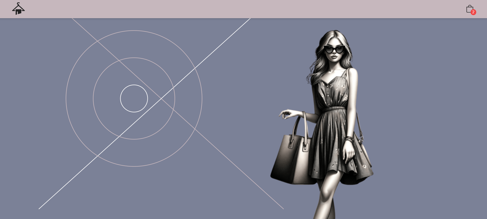

  

# Visual Frontend Store

## Overview

This project is a visual frontend store, designed to showcase a catalog of products using a modern, user-friendly interface. Built with React, it utilizes JavaScript and CSS for dynamic content presentation and responsive layouts. The store's product data is sourced from the Fake Store API, providing a diverse range of items for display.

## Features

- **Product Listing**: Browse through a catalog of products, dynamically loaded from the Fake Store API.
- **Responsive Design**: Crafted with CSS, the layout adjusts seamlessly across devices, ensuring a consistent user experience.
- **Interactive UI**: Engage with intuitive interfaces for viewing product details and managing shopping cart items.

## Technologies

- **React**: For building the user interface with component-based architecture.
- **JavaScript**: For scripting and API interactions.
- **CSS**: For styling and responsive design.
